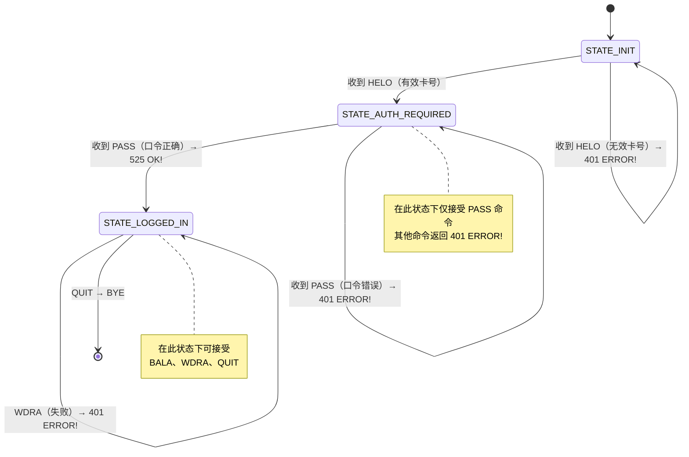
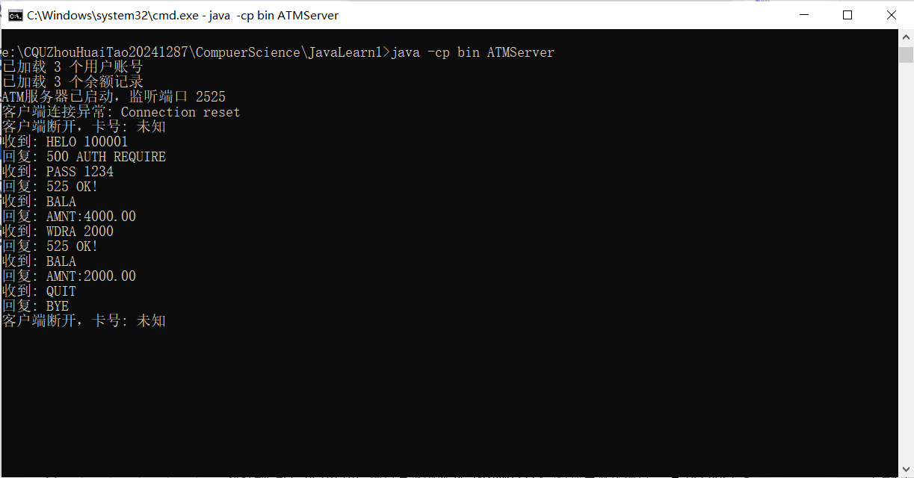
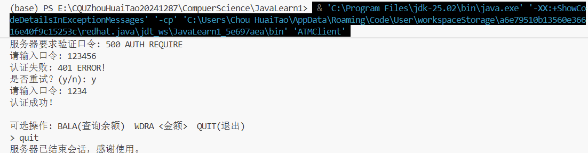
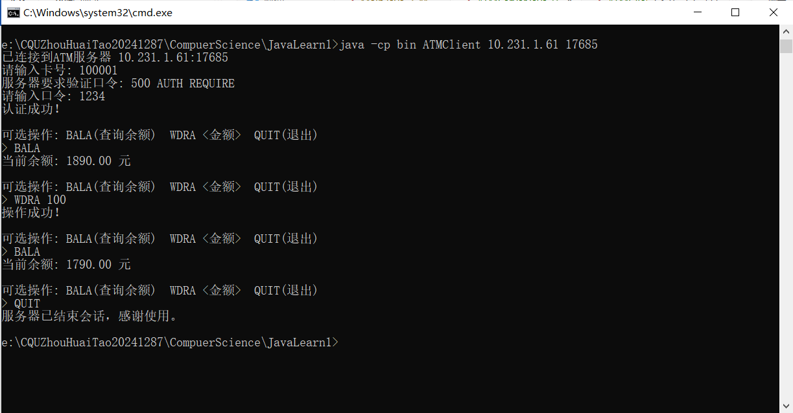
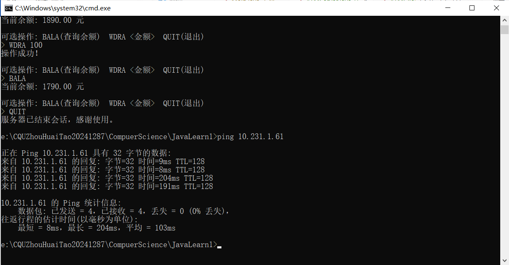

# ATM 自定义协议通信系统 — 实验报告

> **小组成员**：周怀涛（20241287）、杨翔宇  
> **GitHub 项目**：https://github.com/uio8k/ATM-Simulator
> **日期**：2026 年 5 月 23 日

---

## 目录

1. [协议设计说明](#1-协议设计说明)
   - [1.1 报文格式规范](#11-报文格式规范)
   - [1.2 状态转换图](#12-状态转换图)
2. [程序结构](#2-程序结构)
   - [2.1 整体架构](#21-整体架构)
   - [2.2 服务器端 ATMServer](#22-服务器端-atmserver)
   - [2.3 客户端 ATMClient](#23-客户端-atmclient)
3. [运行截图](#3-运行截图)
4. [多元测试](#4-多元测试)
5. [设计要点与遇到的问题](#5-设计要点与遇到的问题)
6. [心得体会](#6-心得体会)

---

## 1. 协议设计说明

### 1.1 报文格式规范

本系统基于 **TCP 自定义应用层协议**，协议编号参考 RFC-20242024。所有报文以**纯文本行**为单位进行交换，使用空格分隔命令与参数。

#### 客户端 → 服务器

| 报文格式 | 说明 |
|----------|------|
| `HELO <userid>` | ATM 插入卡片，将卡号发送给服务器 |
| `PASS <passwd>` | 用户输入口令（PIN），发送给服务器验证 |
| `BALA` | 用户请求查询当前账户余额 |
| `WDRA <amount>` | 用户请求支取 `<amount>` 金额（整数或浮点数，单位：元） |
| `QUIT` | 用户完成所有操作，准备退出 |

> 注：`<userid>`、`<passwd>`、`<amount>` 与实际值之间使用空格分隔（协议中的 "sp" 表示空格）。

#### 服务器 → 客户端

| 报文格式 | 说明 |
|----------|------|
| `500 AUTH REQUIRE` | 服务器收到 HELO 后回复，要求客户端发送口令 |
| `525 OK!` | 操作成功（PASS 验证通过 / WDRA 取款成功） |
| `401 ERROR!` | 操作失败（PASS 验证失败 / WDRA 余额不足 / 非法命令） |
| `AMNT:<amount>` | 响应 BALA 请求，返回当前余额，`<amount>` 为金额数字 |
| `BYE` | 服务器通知客户端正常结束会话，随后关闭连接 |

#### 通信流程示例

```text
客户端 > HELO 100001
服务端 > 500 AUTH REQUIRE
客户端 > PASS 1234
服务端 > 525 OK!
客户端 > BALA
服务端 > AMNT:5000.00
客户端 > WDRA 100
服务端 > 525 OK!
客户端 > QUIT
服务端 > BYE
```

### 1.2 状态转换图

服务器为每个客户端连接维护一个会话状态机，避免非法操作顺序。



> **说明**：以上状态名（`STATE_INIT`、`STATE_AUTH_REQUIRED`、`STATE_LOGGED_IN`）为逻辑概念，实际代码中通过 `currentCard`（是否为 null）和 `authenticated`（布尔值）隐式维护状态。无效 HELO 后服务器仅返回错误并重置 `currentCard=null`，连接仍保持，状态回到初始态等待下一次 HELO。

**状态说明**：

| 状态 | 含义 | 可接受命令 |
|------|------|------------|
| `STATE_INIT` | 初始状态，等待客户端连接 | `HELO` |
| `STATE_AUTH_REQUIRED` | 已收到卡号，等待口令验证 | `PASS` |
| `STATE_LOGGED_IN` | 认证成功，可执行业务操作 | `BALA`, `WDRA`, `QUIT` |

---

## 2. 程序结构

### 2.1 整体架构

```text
┌─────────────┐          TCP/2525          ┌──────────────────┐
│  ATMClient  │ ◄─────────────────────────► │   ATMServer      │
│  (客户端)    │   文本行协议 (CR/LF)         │   (服务器端)      │
└─────────────┘                             └──────────────────┘
                                                   │
                                          ┌────────┴────────┐
                                          │                 │
                                     users.txt        balances.txt
                                   (卡号+口令)        (卡号+余额)
```

- **通信方式**：基于 `java.net.Socket` 的 TCP 长连接
- **IO 模型**：`BufferedReader` / `PrintWriter` 以行为单位进行文本读写
- **并发模型**：服务器端使用 `ExecutorService` 线程池，每连接一个线程
- **数据存储**：文本文件持久化，内存中使用 `ConcurrentHashMap` 保证并发安全

### 2.2 服务器端 ATMServer

**文件**：`ATMServer.java`

**关键类与方法**：

| 类/方法 | 类型 | 说明 |
|---------|------|------|
| `ATMServer` | 主类 | 服务器入口，负责端口监听、线程池管理 |
| `main(String[] args)` | 静态方法 | 解析命令行参数，启动服务器监听 |
| `loadUserData()` | 静态方法 | 从 `users.txt` 和 `balances.txt` 加载数据到内存 Map |
| `saveBalances()` | 静态同步方法 | 将内存中的余额数据写回 `balances.txt`，保证持久化 |
| `ClientHandler` | 内部类 | 实现 `Runnable`，处理单个客户端连接 |
| `processCommand(String cmd)` | 实例方法 | 解析客户端命令，执行对应业务逻辑并返回响应 |

**核心设计要点**：

1. **线程安全**：`userPasswords` 和 `userBalances` 使用 `ConcurrentHashMap`；`saveBalances()` 使用 `synchronized` 修饰，防止并发写文件冲突。
2. **状态机实现**：通过 `currentCard`（当前卡号）和 `authenticated`（认证标志）两个变量隐式维护状态，配合 `processCommand` 中的 `switch` 分支控制合法操作。
3. **端口配置**：支持命令行参数指定端口（如 `java ATMServer 2525`），端口范围为 1024~65535，默认 2525。
4. **优雅降级**：数据文件读取失败时使用空数据集，不会导致服务器崩溃。

### 2.3 客户端 ATMClient

**文件**：`ATMClient.java`

**关键类与方法**：

| 类/方法 | 类型 | 说明 |
|---------|------|------|
| `ATMClient` | 主类 | 客户端入口，模拟 ATM 终端交互 |
| `main(String[] args)` | 静态方法 | 解析命令行参数（服务器 IP 和端口），建立连接并进入交互循环 |

**核心设计要点**：

1. **参数灵活性**：支持 `java ATMClient`（默认 127.0.0.1:2525）、`java ATMClient 192.168.1.1`（指定 IP）、`java ATMClient 192.168.1.1 8080`（指定 IP 和端口）三种用法。
2. **交互流程**：严格按照协议顺序——先 HELO，再 PASS，认证通过后进入主菜单循环（BALA / WDRA / QUIT）。卡号输入和口令验证各自支持最多 3 次重试，每次失败后提示用户选择是否继续，满足作业要求中"可重试或退出"的交互需求。
3. **响应解析**：根据服务器返回的前缀（`AMNT:`、`525`、`401`、`BYE`）进行分支处理，给用户友好的中文提示。

---

## 3. 运行截图

### 3.1 服务器启动，认证，查询，取款，余额不足（这一点待补充），认证失败



### 3.2 退出

> **输入 QUIT 后显示"服务器已结束会话，感谢使用**

### 3.8 多客户端并发测试

> **[此处插入截图：多个客户端终端同时连接服务器进行操作的画面]**

---

## 4. 多元测试

协议标准化使得不同语言 / 平台实现的客户端和服务端可以互通。

|  | A 组服务端 | B 组服务端 | C 组服务端 | D 组服务端 |
|--|-----------|-----------|-----------|-----------|
| **A 组客户端** | ✓（本组自测） | [ ] | [ ] | [ ] |
| **B 组客户端** | [ ] | ✓（本组自测） | [ ] | [ ] |
| **C 组客户端** | [ ] | [ ] | ✓（本组自测） | [ ] |
| **D 组客户端** | [ ] | [ ] | [ ] | ✓（本组自测） |




> **跨组测试的运行截图**  

---

## 5. 设计要点与遇到的问题

### 5.1 并发线程安全（设计阶段已考虑）

**关注点**：多个客户端同时取款时，`balances.txt` 可能被多线程同时写入导致数据错乱。

**解决方案**：在编码阶段即采用了以下防护措施：
- 内存数据使用 `ConcurrentHashMap`，保证多线程读写的原子性
- `saveBalances()` 方法用 `synchronized` 修饰（静态方法锁在类对象上），确保同一时刻仅一个线程执行文件写入
- 线程池使用 `Executors.newCachedThreadPool()` 管理线程生命周期

### 5.2 PrintWriter 缓冲刷新（设计阶段已考虑）

**关注点**：`PrintWriter` 默认不自动刷新，可能导致客户端收不到响应或提示信息不显示。

**解决方案**：
- 服务端构造 `PrintWriter` 时传入 `true`（`new PrintWriter(socket.getOutputStream(), true)`）开启自动刷新
- 客户端在 `System.out.print()` 后显式调用 `System.out.flush()`，确保提示信息在等待用户输入前已输出

### 5.3 Socket 资源释放（设计阶段已考虑）

**关注点**：客户端异常断开（直接关闭窗口或网络中断）时，服务端线程需正确释放 Socket 资源。

**解决方案**：在 `ClientHandler.run()` 的 `finally` 块中使用 `try-catch` 包裹 `socket.close()`，确保无论正常退出还是异常断开，Socket 都能被关闭。

### 5.4 客户端认证重试机制（已改进）

**初始版本现象**：客户端在卡号无效或口令错误时直接 `return` 退出，未给用户重试机会。

**改进方案**：在两个认证阶段分别添加重试循环（最多 3 次），每次失败后询问用户"是否重试？(y/n)"，用户可选择继续或退出，3 次均失败后自动退出。满足作业中"可重试或退出"的要求。

### 5.5 项目路径与数据文件位置

**现象**：`ATMServer` 使用相对路径（`new FileReader("users.txt")`）读取数据文件，启动时的**当前工作目录**必须包含这两个文件，否则加载失败。

**说明**：在 IDE 中运行时，工作目录通常是项目根目录，因此 `users.txt` 和 `balances.txt` 需放在项目根目录下。在命令行运行时，需确保在包含这两个文件的目录下执行 `java ATMServer`。

---

## 6. 心得体会

### 6.1 对 TCP 自定义协议的理解

通过本次实验，我们深刻理解了 TCP 协议"面向连接、可靠传输"的特性。TCP 保证了数据按序、无差错地到达，这使得我们在设计应用层协议时无需考虑分包、重传等底层问题，只需专注于命令和响应的语义设计。

自定义协议的核心是**约定**——双方必须严格遵守报文格式和交互顺序。我们设计的协议虽然简单，但涵盖了**认证—操作—退出**的完整生命周期，状态机的设计确保了协议的健壮性。

### 6.2 对多线程编程的理解

服务器使用 `CachedThreadPool` 实现了多客户端并发处理。我们认识到：

- **线程安全是重中之重**：共享数据（用户口令、余额）必须使用线程安全的数据结构（`ConcurrentHashMap`），写文件操作必须加锁。
- **线程池优于手动创建线程**：`Executors.newCachedThreadPool()` 能够按需创建线程并复用空闲线程，避免了频繁创建销毁的开销。
- **每个连接一个线程**是简单有效的模型，适合客户端数量适中的场景。

### 6.3 对数据持久化的理解

本系统使用文本文件作为持久化存储，每次取款成功后立即重写整个 `balances.txt`。这种方式虽然简单，但让我们直观地理解了：

- **内存与磁盘的一致性**：数据修改后需要及时写回磁盘，否则系统宕机会导致数据丢失。
- **文件 IO 的性能代价**：每次取款都触发全量文件写入，在高并发场景下会成为瓶颈。真正的银行系统会使用数据库的事务机制来保证 ACID 特性。
- **简单方案的价值**：对于教学项目而言，文本文件存储易于理解、便于调试，是学习持久化概念的绝佳起点。

### 6.4 总结

本次实验从零开始构建了一个完整的 Client-Server 通信系统，涵盖了网络编程、多线程、文件 IO、状态机设计等多个知识点。通过跨组测试，我们更深刻体会到**标准化协议**的价值——只要双方遵守共同的协议规范，无论用什么语言、运行在什么平台上，都能实现无缝通信。这种思想正是互联网能够互联互通的基础。

---

> **项目地址**：https://github.com/uio8k/ATM-Simulator  
> **成员分工**：周怀涛（服务器端与协议设计）、杨翔宇（客户端实现与测试）

